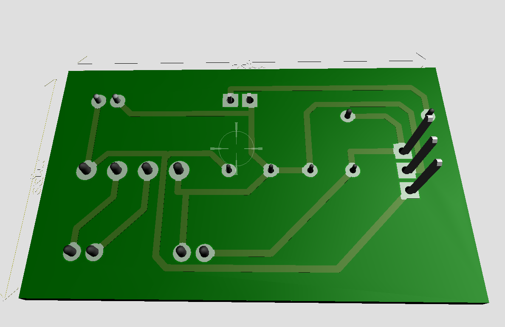
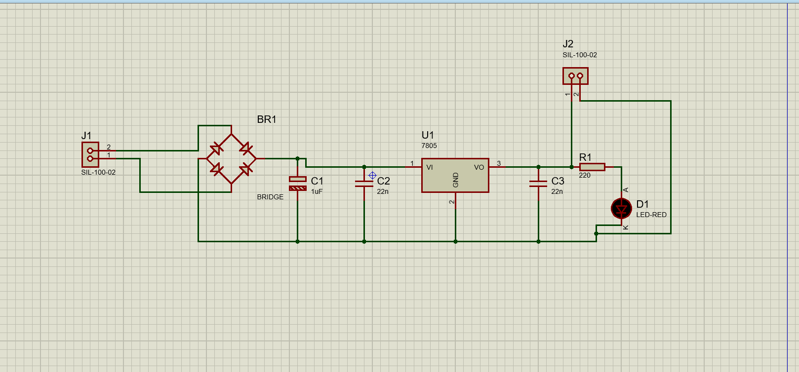
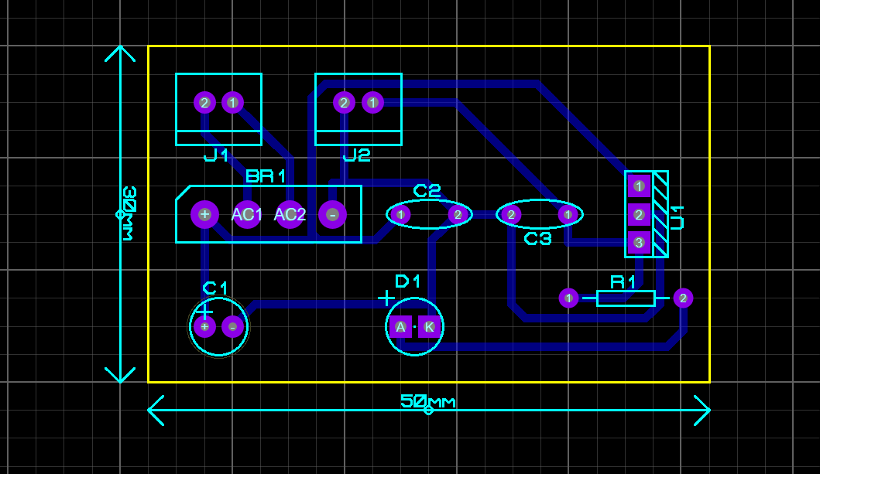
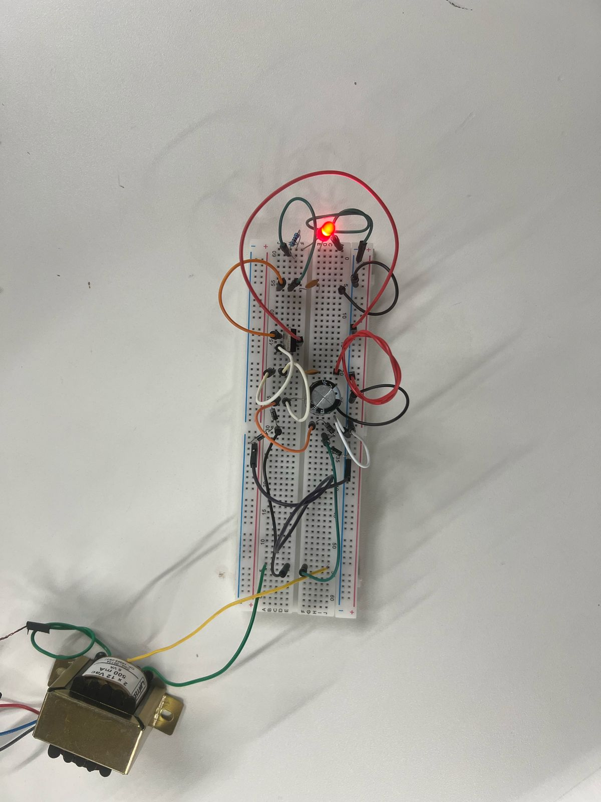

# Fonte de 5V com Regulador 7805

Projeto simples de uma fonte que transforma a tensão da tomada em 5V DC, usando um regulador 7805. Serve pra alimentar Arduino, sensores, ou qualquer circuito que precise de 5V estável.

---

## Visão Geral

### Modelo 3D
Visualização do projeto em 3D, só pra ter uma noção de como fica montado.

---

### Esquemático
Diagrama elétrico com os componentes ligados certinho.

---

### PCB
Layout da placa de circuito impresso.

---

### Protótipo
Montagem real na protoboard pra testar tudo.

---

## Componentes

- **TR1** – Transformador 110/220V pra 12V AC
- **BR1** – Ponte retificadora
- **C1 (1µF)** – Capacitor de filtragem
- **U1** – Regulador 7805
- **C2 e C3 (22nF)** – Capacitores pra tirar ruído
- **D1 (LED) + R1 (220Ω)** – Indicador de funcionamento

---

## Como Funciona

1. Transformador reduz a tensão.
2. Ponte retificadora converte AC pra DC.
3. C1 suaviza a tensão.
4. 7805 regula pra 5V.
5. C2 e C3 limpam o sinal.
6. LED acende se tudo estiver ok.

---
